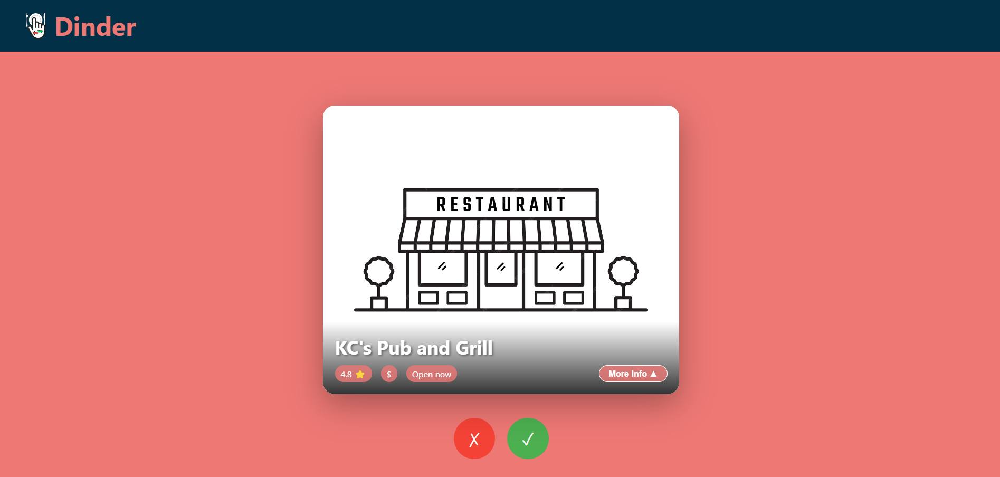
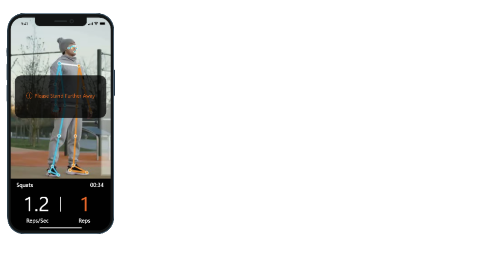

  

# Welcome!
I'm a senior at Rensselaer Polytechnic Institute 🎓, graduating in December 2024 with a Dual Bachelor's in Computer Science and Cognitive Science, plus a Minor in Finance.

## 🔧 Technologies & Tools
- **Languages**: Python, JavaScript, C++, Java
- **Frameworks**: React, Node.js, Express, Flask
- **Databases**: MongoDB, MySQL
- **Other Tools**: Git, Docker, Figma

## 🚀 Featured Projects
### [Dinder](https://github.com/PaulKratsios18/Dinder)  
#### Swipe. Match. Eat.
Dinder is a web application designed to answer the question: "Where should we eat?" It makes group restaurant decisions fun and collaborative by letting users swipe left or right on restaurant options. The app uses advanced ranking and matching algorithms to find the perfect spot for everyone.

#### Key Features
- **Group Matchmaking**: Host or join sessions using a unique code to decide as a group.
- **Preference Filtering**: Set preferences like cuisine, price range, and location.
- **Interactive Swiping**: Swipe through restaurant options with detailed info (e.g., ratings, distance).
- **Real-Time Results**: See matches live and make decisions easily.

#### Media
<table>
  <tr>
    <td></td>
    <td></td>
    <td></td>
  </tr>
</table>

#### What I Learned
Building Dinder enhanced my skills in:
- Developing scalable, user-focused web applications.
- Integrating third-party APIs like Google Places for restaurant data.
- Collaborative teamwork using GitHub and Jira for project management.

### [HiroFit](https://github.com/PaulKratsios18/HiroFit)  
A fitness app for tracking your workouts.

## 📫 Let's Connect
- **LinkedIn**: [Paul Kratsios](https://www.linkedin.com/in/paulkratsios)
- **Portfolio Website**: [paulkratsios.dev](https://paulkratsios.dev)
