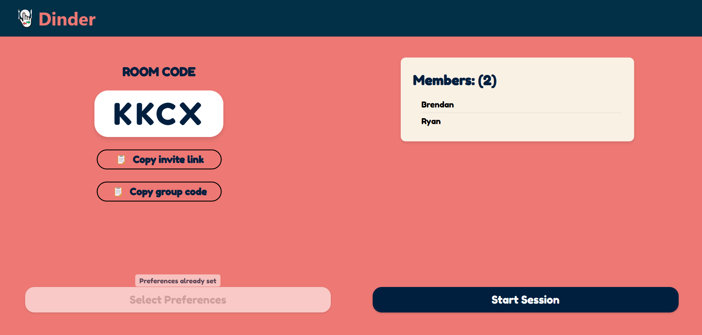
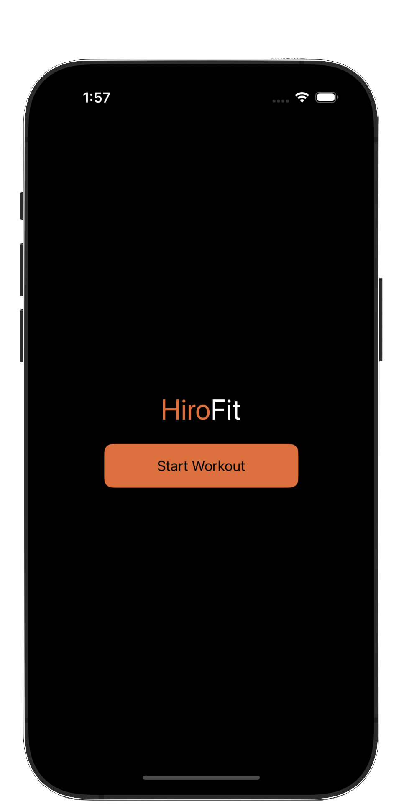
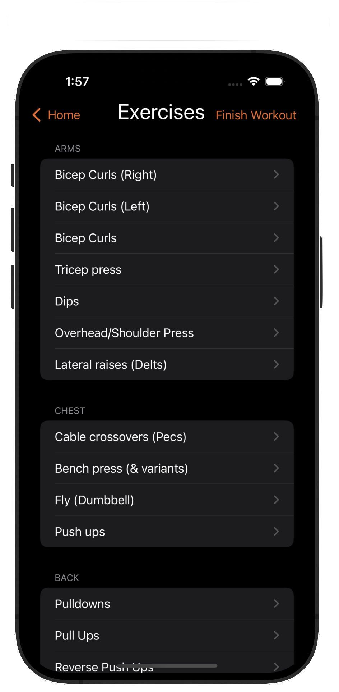
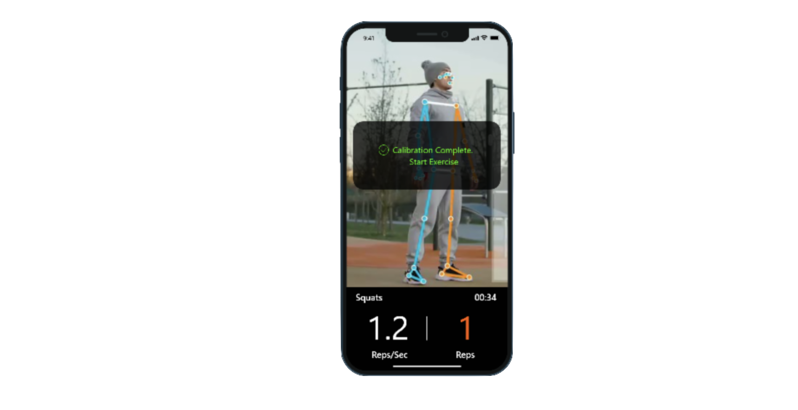
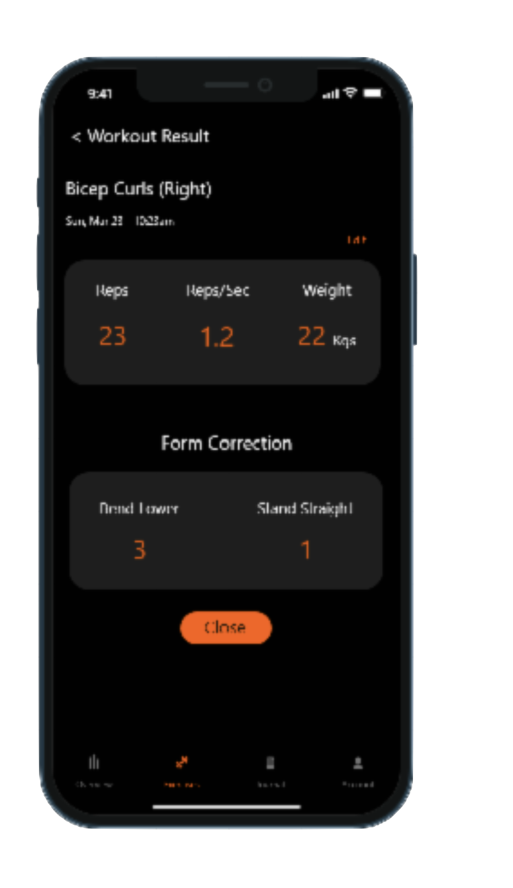

  

# Welcome!
I'm a senior at Rensselaer Polytechnic Institute 🎓, graduating in December 2024 with a Dual Bachelor's in Computer Science and Cognitive Science, plus a Minor in Finance.
## 📫 Let's Connect

  
  

## 🚀 Featured Projects
### [Dinder](https://github.com/PaulKratsios18/Dinder)  
#### Swipe. Match. Eat.
Dinder is a web application designed to answer the question: "Where should we eat?" It makes group restaurant decisions fun and collaborative by letting users swipe left or right on restaurant options. The app uses advanced ranking and matching algorithms to find the perfect spot for everyone.

#### Key Features
- **Group Matchmaking**: Host or join sessions using a unique code to decide as a group.
- **Preference Filtering**: Set preferences like cuisine, price range, and location.
- **Interactive Swiping**: Swipe through restaurant options with detailed info (e.g., ratings, distance).
- **Real-Time Results**: See matches live and make decisions easily.

#### Media

  
  
  

### [HiroFit](https://github.com/PaulKratsios18/HiroFit)  
#### A Machine Learning-Based Fitness App
HiroFit was an application that utilizes computer vision and machine learning to track your workouts and provide real-time tips for improvement. I led the iOS frontend development for HiroFit, while the models and backend were handled by other team members.

#### Key Features
- **Real-Time Tracking**: Uses computer vision to monitor your movements during workouts.
- **Personalized Feedback**: Provides tips and suggestions based on your performance.
- **User-Friendly Interface**: Designed for ease of use, making workout tracking seamless.

#### Media

  
  
  
  

### [Adaptive Agents in Uncertain Environments](https://github.com/PaulKratsios18/AdaptiveAgentsInUncertainEnvironments)  
#### Optimizing Decision-Making Through Reinforcement Learning
A research project exploring how reinforcement learning agents can adapt to uncertainty and recognize different cognitive strategies in variations of the classic Monty Hall problem. The dual-learning algorithm enables agents to both optimize their own decision-making while modeling the cognitive traits of other agents they interact with.

#### Key Features
- **Dual Learning**: Agents simultaneously optimize decisions and model other agents' behaviors.
- **Cognitive Modeling**: Analysis of different decision-making strategies in uncertain environments.
- **Monty Hall Variations**: Novel adaptations of the classic probability problem.

#### Media

  
  
  

### [Hockey Puck Tracking System](https://github.com/PaulKratsios18/HockeyPuckTrackingSystem)  
#### A Computer Vision-Based System for Tracking Hockey Pucks
A sophisticated computer vision system designed to track hockey pucks in real-time. The system leverages advanced image processing and machine learning techniques to accurately detect and track puck movement on the ice, while also analyzing stick movements for comprehensive training analysis.

#### Key Features
- **Real-Time Tracking**: Developed custom computer vision algorithms for precise puck detection and tracking in real-time gameplay conditions
- **Stick Movement Analysis**: Working on synchronizing stick movement detection with puck tracking for detailed player performance insights
- **Training Integration**: Building an immersive training experience by combining puck and stick movement data
- **User-Friendly Interface**: Designed for ease of use, providing clear visualization of tracking results

#### Media

  
  

## 🔧 Technologies & Tools
- **Languages**: Python, C/C++, JavaScript, TypeScript, SQL, Java, Swift, R
- **Data Science**: Pandas, NumPy, Beautiful Soup, Scikit-learn
- **Frontend**: React, HTML/CSS, Bootstrap, Material-UI
- **Backend**: Node.js, Express, Flask, REST APIs
- **Databases**: MongoDB, MySQL, PostgreSQL
- **Developer Tools**: Git, Docker, AWS, CI/CD
- **Project Management**: Jira, Miro, Figma
- **Operating Systems**: MacOS, Windows, Unix/Linux
