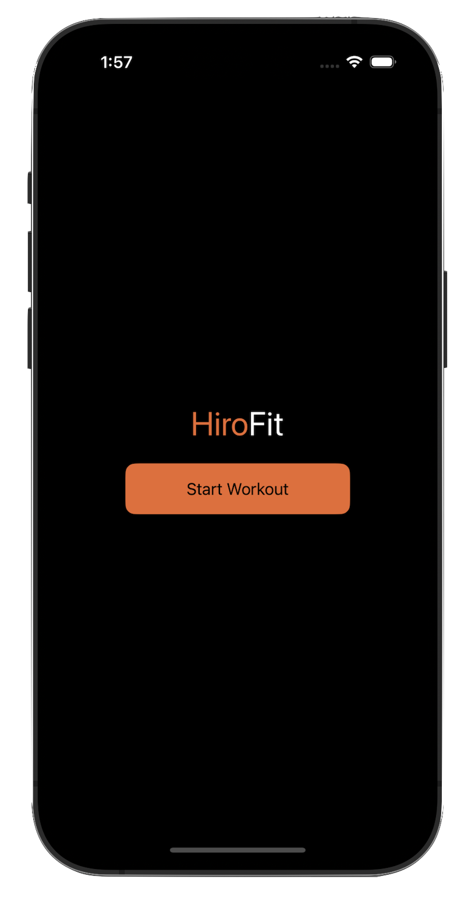
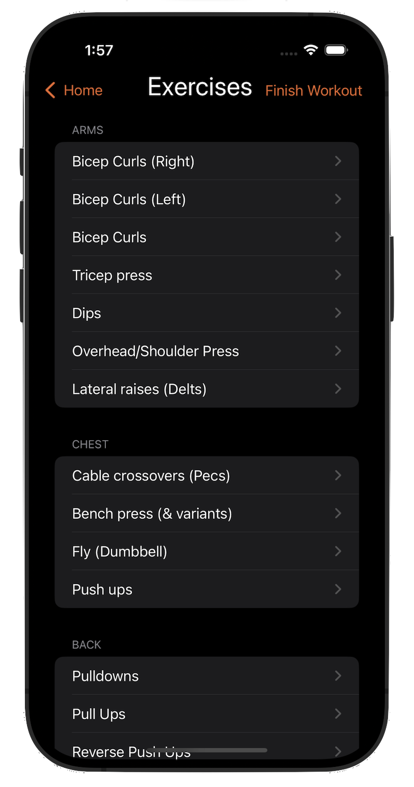

  

# Welcome!
I'm a senior at Rensselaer Polytechnic Institute 🎓, graduating in December 2024 with a Dual Bachelor's in Computer Science and Cognitive Science, plus a Minor in Finance.

## 🔧 Technologies & Tools
- **Languages**: Python, JavaScript, C++, Java
- **Frameworks**: React, Node.js, Express, Flask
- **Databases**: MongoDB, MySQL
- **Other Tools**: Git, Docker, Figma

## 🚀 Featured Projects
### [Dinder](https://github.com/PaulKratsios18/Dinder)  
#### Swipe. Match. Eat.
Dinder is a web application designed to answer the question: "Where should we eat?" It makes group restaurant decisions fun and collaborative by letting users swipe left or right on restaurant options. The app uses advanced ranking and matching algorithms to find the perfect spot for everyone.

#### Key Features
- **Group Matchmaking**: Host or join sessions using a unique code to decide as a group.
- **Preference Filtering**: Set preferences like cuisine, price range, and location.
- **Interactive Swiping**: Swipe through restaurant options with detailed info (e.g., ratings, distance).
- **Real-Time Results**: See matches live and make decisions easily.

#### Media

  
  
  

### [HiroFit](https://github.com/PaulKratsios18/HiroFit)  
#### A Machine Learning-Based Fitness App
HiroFit was an application that utilizes computer vision and machine learning to track your workouts and provide real-time tips for improvement. I led the iOS frontend development for HiroFit, while the models and backend were handled by other team members.

#### Key Features
- **Real-Time Tracking**: Uses computer vision to monitor your movements during workouts.
- **Personalized Feedback**: Provides tips and suggestions based on your performance.
- **User-Friendly Interface**: Designed for ease of use, making workout tracking seamless.

#### Media

  
  
  
  

## 📫 Let's Connect
- **LinkedIn**: [Paul Kratsios](https://www.linkedin.com/in/paulkratsios)
- **Portfolio Website**: [paulkratsios.dev](https://paulkratsios.dev)
